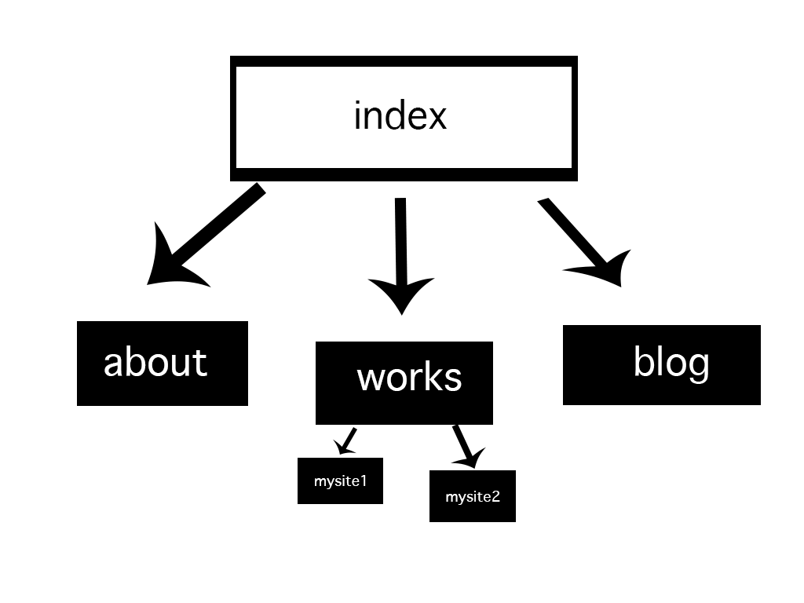

1.
Information Gathering
Planning
Design
Development
Testing and Delivery
Maintenance

2. I intend to make a site that will act as a virtual resume, introducing interested parties to what I’ve created and achieved over the past 5+ years since college. I would like to have a thoughtfully designed homepage that piques the viewers interest, a portfolio page with screenshots and links to my entrepreneurial efforts, a blog to showcase my writing skills, and a contact form that will feed inquires to my email inbox. 

3. The intended audience for my site is people interested in working with me, either to employ me or work on existing projects. I want to make sure that the site showcases what I’ve learned bout marketing and 

4. My primary audience is future employers. I would like them to visit the index/homepage, click over to the About page, and then exit the site by visiting one of my other sites, either Pinterest Fail or Jenna Cole Photography. The blog posts are supplementary to increase my SEO and showcase my SEO skills, but I think my future employers will care most about my ability to think creatively and analyze the market. 

5. A UX desiner should understand flow and be able to calculate how different users will enter and exit the site, and what content they will consume during their visit. They shuld be able to analyze data from services such as Google Analytics to better understand the pathways that users take and utilize that data to increase the average session duration and decrease the bounce rate for each visitor. 

6. User experience design analyzes the route each user takes when visiting the website and attempts to maximize the amount of time that each user spends on the site, and increase the amount of content each user consumes while visiting the site or product. It also follows the route that users will take and tries to minimize any roadblocks a user might encounter. 

7. I actually did the wireframing challenge first, and once I learned how to do a relative link for the images it was easy to finish. I wonder if it might be easier for some people to draft their site visually first, and then think through a logical path that each user will follow via a sitemap.

