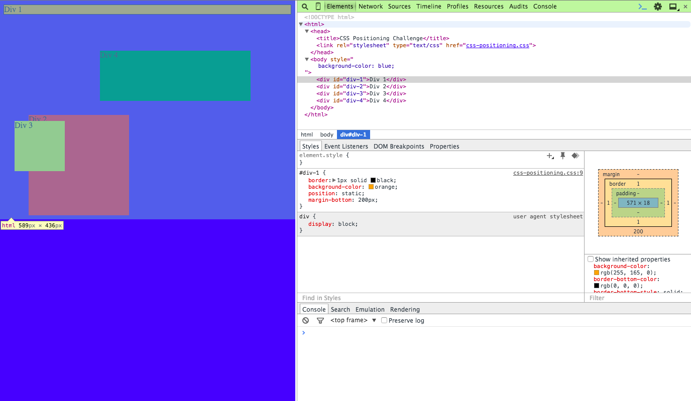
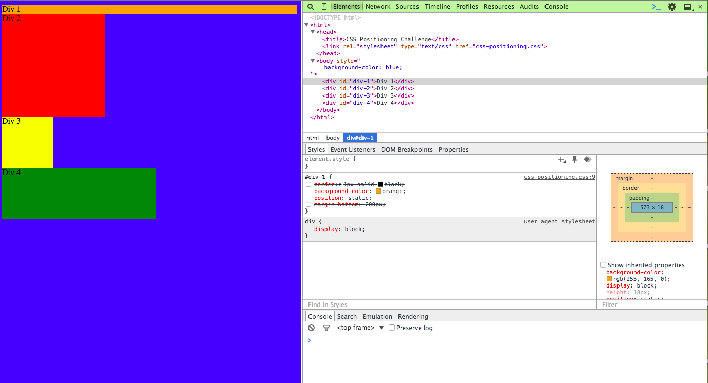
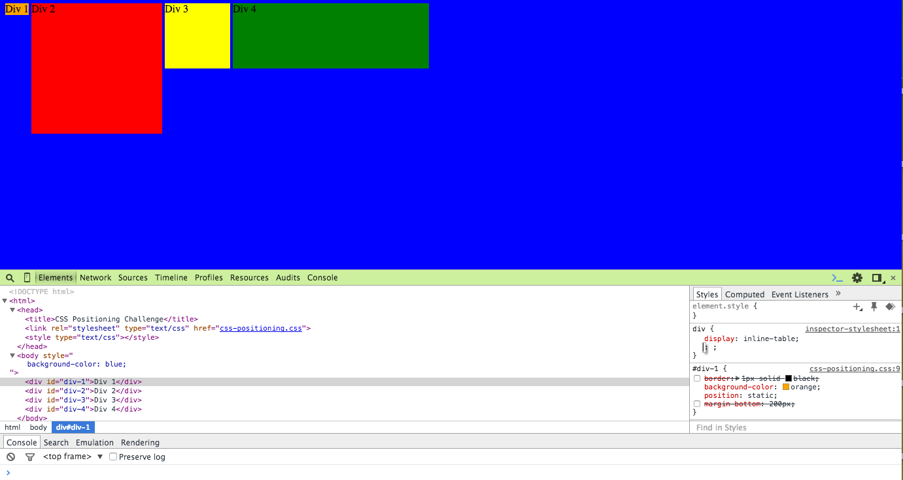
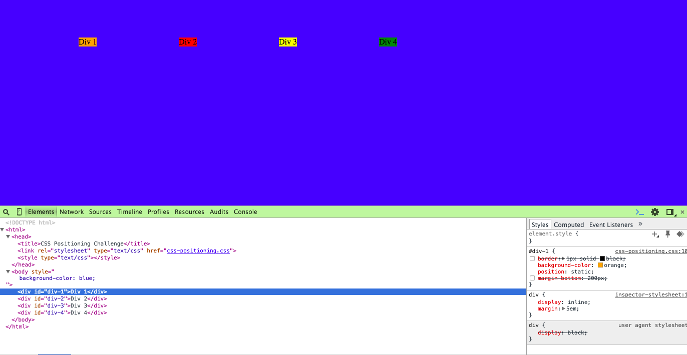
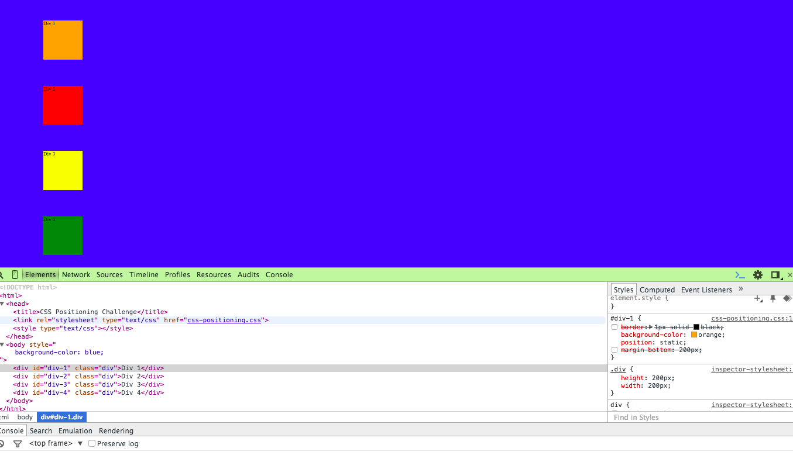
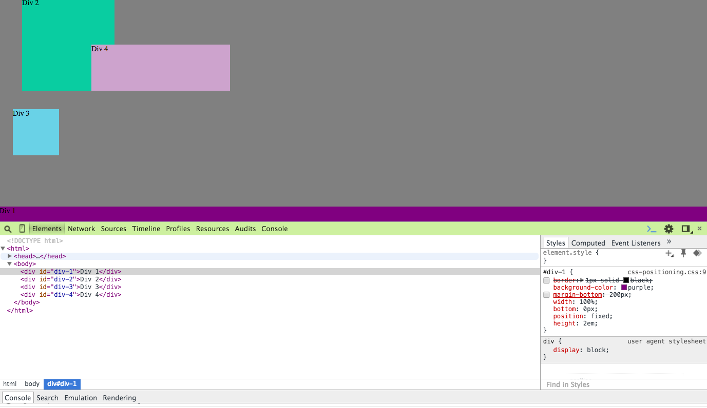
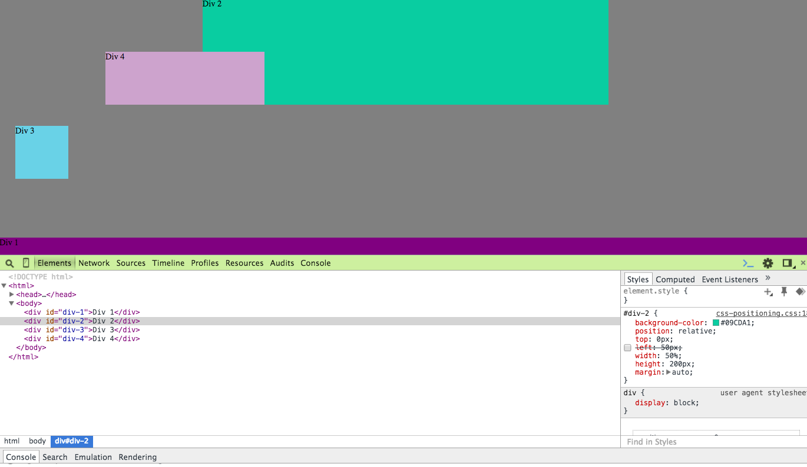
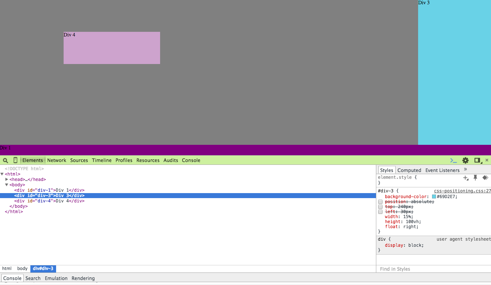
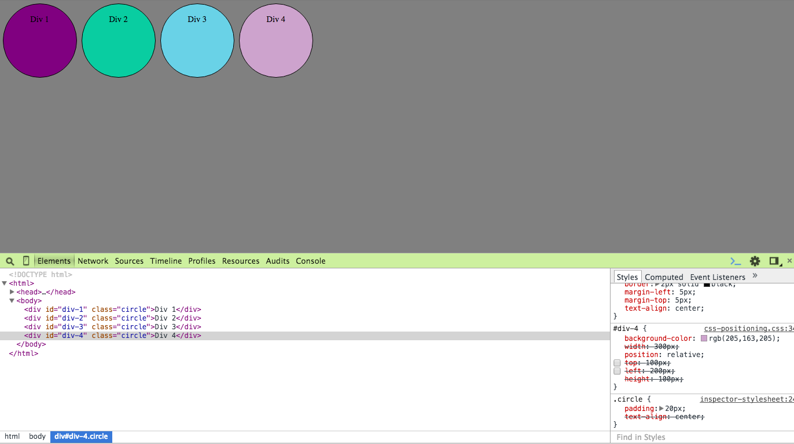

-Chrome DevTools allows me to be very agile as I expirement and make changes to the way my webpage looks. No need to write in a text editor, save, move to Chrome, and refresh. I can visually see the elements on the page, use the microscope to quickly locate specific elements in the HTML or CSS, and manipulate the code without any worry about having to revert the changes in my permanent document. 
-I do not understand this question.
-
Fixed position means it is fixed in the viewport, or the viewing window. The element will stay in place on the screen even when the user scrolls. 
Static position determines that an object will fall where it is expected to fall based on its position in the HTML
Absolute position takes the element out of the normal expected flow and can be placed exactly where the designer intends. Absolute position elements do not affect other elements, nor are they affected by other elements in the normal flow of the page. Changing an element to absolute positioning will cause it to default to a position in relation to the document as a whole. The document will view the elmenent as being completely removed from the normal flow. 
Relative position will change the position of the element in relation to itself, or where it normally would have been placed in the flow of the HTML document. A relatively positioned object does not care about other items in the normal flow of the page. 
-Fixed positioning is the easiest to use because it feels like once the item is placed, it's not going anywhere, no matter what changes are made to the other elements on the page.
-I think of margin/border/padding like a picture framed on a wall. The margin is the wall itself, the border is the frame, the padding is the mat, and the conent itself is the photo. 
-CSS can be really frustrating as we're learning how positiong, float, etc function and I thought it was helpful to have two brains attacking the problem instead of one. I found that with one person acting as the driver and testing out things in the DevTools the other could be using Google to research and clarify what was happening. I think it would have been a much slower process if I was going at it alone.
