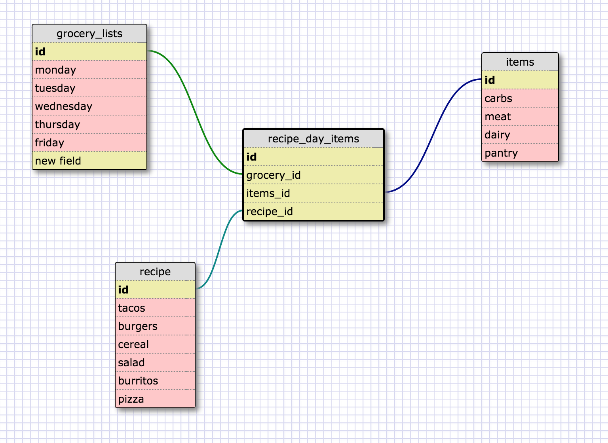

A one-to-one relationship is one where a parent element can only have a specific type of relationship with one child. In this case the parent element ("child") can only have one maternal grandmother.

What is a one-to-one database?

	-*A one-to-one database has a parent with a child that has only possibility for the identity of the child element.* 
When would you use a one-to-one database? (Think generally, not in terms of the example you created).

	-*When dealing with a relationship where there is one possible option. I really like the state and state capital example and I'll be referencing back to that each time I'm working through what a one-to-one relationship means.*
What is a many-to-many database?

	-*Many-to-many databases are made up of elements where the object has many facets, and the children of that element have many facets as well.* 
What is confusing about database schemas? What makes sense?

	-*I have a hard time thinking about these concepts in the abstract. I think it will become easier for me as I work to create databases for specific situations.* 
